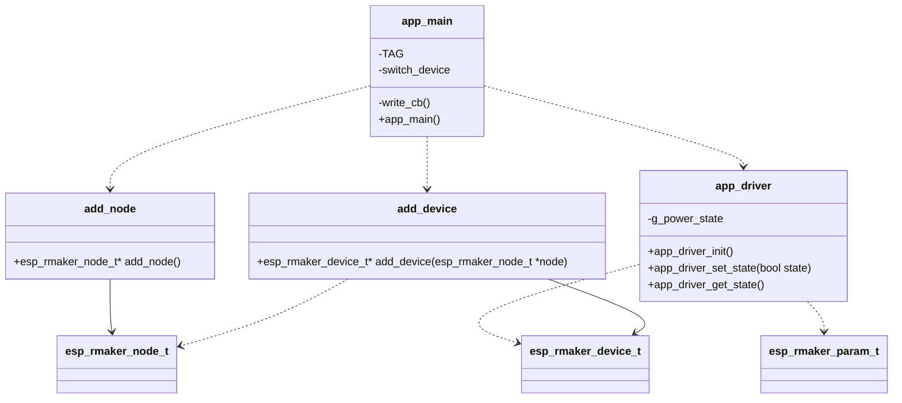

- The key classes are:

- `add_device` - Creates and configures an `esp_rmaker_device_t` switch device and adds it to a node.
- `add_node` - Initializes an `esp_rmaker_node_t` Rainmaker node.
- `app_driver` - Handles button input and LED output. Accesses `esp_rmaker_param_t` and `esp_rmaker_device_t`.
- `app_main` - Brings together the other classes by initializing WiFi, registering events, and calling `add_node` and `add_device`.
