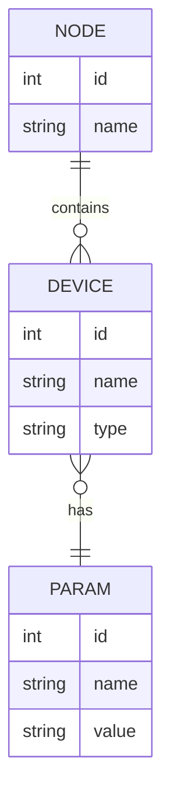

# Rainmaker Switch Entity-Relationship Diagram

- The key entities are:

- NODE - Represents an ESP Rainmaker node, with id and name attributes.
- DEVICE - Represents a device created using ESP Rainmaker, with id, name, and type attributes. A device is contained in a node.
- PARAM - Represents a parameter of a device, with id, name, and value attributes. A device has multiple params.

The relationships are:

- A NODE contains zero or more DEVICEs
- A DEVICE has one or more PARAMs
