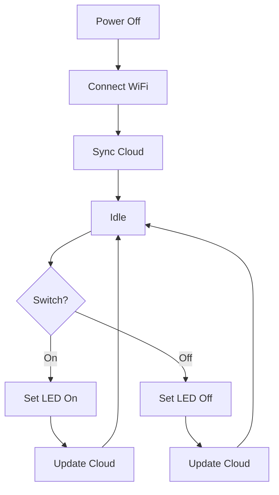

- Rainmaker Switch:
1. Start in Power Off state
2. Connect WiFi
3. Sync state to cloud
4. Enter Idle state
5. On switch press:
    1. If switch turned on:
        1. Set LED on
        2. Update cloud
    2. If switch turned off:
        1. Set LED off
        2. Update cloud
6. Back to Idle state
