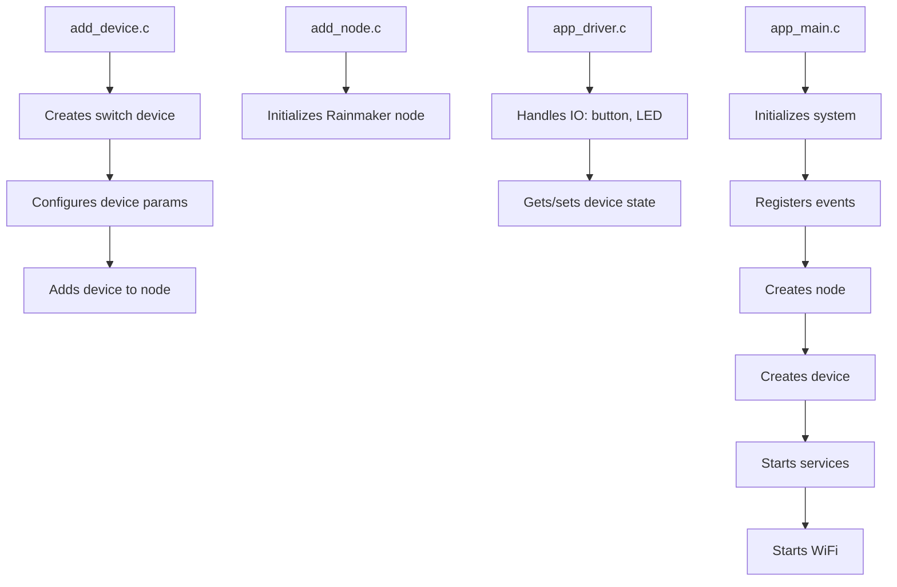

This is the high-level process flow and file layout:

```mermaid
graph TD
A[add_device.c] --> B[Creates switch device]
B --> C[Configures device params]
C --> D[Adds device to node]
E[add_node.c] --> F[Initializes Rainmaker node]
G[app_driver.c] --> H[Handles IO: button, LED] 
H --> I[Gets/sets device state]
J[app_main.c] --> K[Initializes system]
K --> L[Registers events] 
L --> M[Creates node]
M --> N[Creates device] 
N --> O[Starts services]
O --> P[Starts WiFi]
```