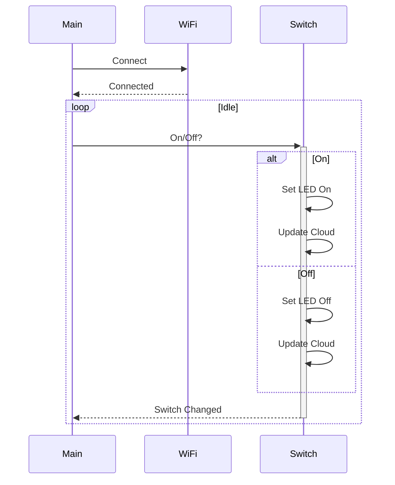

- The key interactions are:

- Main initializes WiFi and Cloud connections
- On each switch change:
    - Switch interacts with LED to set state
    - Switch updates cloud
    - Switch returns new state to Main
- Main loops in idle state

