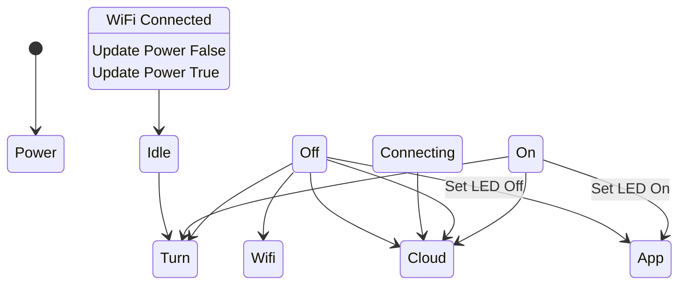

- The key states are:
- Wifi Connecting - Connecting to WiFi network
- Cloud Syncing - Syncing state to cloud
- Idle - Connected to WiFi, cloud sync done
- Turn Off - The switch is off
- Turn On - The switch is on

The transitions between states are:
- Power Off -> Wifi Connecting -> Cloud Syncing - On bootup
- Any State -> Cloud Syncing - When updating cloud
- Cloud Syncing -> Idle - When sync done
- Turn Off -> Turn On - The button is pressed to turn on
- Turn On -> Turn Off - The button is pressed to turn off

Each state results in two actions:
1. The app updates the LED
2. The power parameter is updated in the cloud

- The flow is:
1. Boot to Power Off
2. Connect WiFi
3. Sync state to cloud
4. Idle
5. User toggles switch
6. Update cloud
7. Sync done, back to Idle
